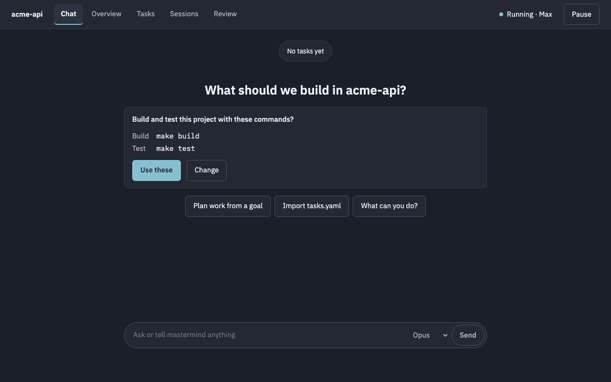

# Mastermind

**Run a team of Claude Code sessions on one repository, and steer them from a single chat.**

[](https://github.com/Jiajianou/mastermind/actions/workflows/ci.yml)
[](LICENSE)


<!-- demo:start -->
<p align="center"></p>
<!-- demo:end -->

You describe what you want in plain words. Mastermind turns it into a plan of small tasks, runs each task in its
own headless Claude Code session and its own clone of your repo, checks the result with your build and tests, has
it reviewed, and lands finished work on your main branch as one clean commit per task.

Everything runs on your machine, on your existing Claude Pro or Max subscription. Nothing is pushed anywhere.

## Highlights

- **Chat first.** A Conductor session plans with you, answers questions about what is running, and acts through a
  small set of tools. Anything irreversible waits for your click.
- **Parallel, but ordered.** Tasks form a dependency graph. Independent tasks run side by side, and dependent ones
  wait for what they need.
- **Isolated workers.** Each worker runs in its own clone inside Claude Code's sandbox, so it can't move your main
  branch or touch your other branches.
- **Checked and reviewed.** Every result runs your build and test commands, then gets an automatic review. Failing
  checks go to a fixer session.
- **You stay in control.** Watch sessions live, read diffs as they are written, comment on lines, request changes,
  and choose which paths always need your approval.
- **Clean history.** Approved work is rebased onto main as one commit per task. No merge commits, and no AI
  attribution trailers.
- **Local and safe to stop.** Mastermind never pushes, fetches or opens pull requests. Press Ctrl+C twice and every
  session it started is gone. The next start picks up where it left off.

## How it works

1. **Plan.** Tell the Conductor your goal. It proposes a plan of tasks, each with a goal, an acceptance check, the
   paths it touches and what it depends on. Press **Start** when it looks right.
2. **Work.** Workers pick up ready tasks in parallel, up to your plan's limit, each in a fresh clone of the repo.
3. **Check.** When a worker finishes, mastermind runs your build and test commands. If they fail, a fixer gets the
   output and tries again, up to a set number of attempts.
4. **Review.** A reviewer session reads the diff and leaves findings. Tasks that touch paths you protect wait in
   **Review**, where you can approve them or request changes.
5. **Land.** Approved tasks are rebased onto main one at a time, and the tasks that depend on them start next.

## Requirements

- **macOS or Linux.** WSL counts as Linux. On Linux the sandbox also needs `bubblewrap` and `socat`.
- **Node.js 22.13 or later**, plus **git**.
- **[Claude Code](https://docs.claude.com/en/docs/claude-code) 2.1.283 or later**, on your PATH as `claude`.
- **A Claude Pro or Max subscription**, signed in to Claude Code with your claude.ai account.

> [!IMPORTANT]
> Mastermind only works with Claude Pro and Max subscriptions. API keys, Console billing, Bedrock, Vertex, and
> Team or Enterprise plans are not supported. Mastermind never stores credentials; your sign-in stays with Claude
> Code.

## Install

```sh
git clone https://github.com/Jiajianou/mastermind.git
cd mastermind
./install.sh
```

The installer checks the requirements, installs pnpm if it is missing, builds the project, and links `mastermind`
onto your PATH. If it had to add pnpm's bin directory to your shell profile, open a new terminal. Run
`./install.sh` again after pulling updates.

Check that your machine is ready. This changes nothing:

```sh
mastermind doctor ~/code/myproject
```

Doctor checks git, the Claude Code version, your sign-in and plan, Claude's attribution setting, the project
config, disk used by task clones, logs and the sandbox.

## Quick start

```sh
cd ~/code/myproject
git switch -c dev        # mastermind asks you to work off a branch other than main
mastermind . --open
```

On first run, mastermind checks your Claude sign-in (and starts Claude Code's login if needed), detects your build
and test commands, writes `.mastermind/config.yaml`, and serves the web app at a private link such as
`http://127.0.0.1:4700/#t=…`. Confirm the detected commands, then tell the Conductor what to build.

The terminal stays in the foreground and shows what is running. **Press Ctrl+C twice to stop mastermind and every
session it started.** Closing the terminal does the same.

### The web app

| Screen       | What it is for                                                                    |
| ------------ | --------------------------------------------------------------------------------- |
| **Chat**     | Talk to the Conductor: plan work, ask what is happening, confirm decisions.       |
| **Overview** | Running sessions and their latest actions, what is up next, and task counts.      |
| **Tasks**    | The task board and the dependency graph.                                          |
| **Sessions** | The full timeline of any session, live.                                           |
| **Review**   | Live diffs, reviewer findings, line comments, request changes, approve and land.  |
| **Settings** | Models, build and test commands, and the rest of the configuration.               |

### From another terminal

While mastermind runs, you can drive it from the command line too:

```sh
mastermind status                    # what is running right now
mastermind tasks                     # list tasks
mastermind logs <task> -f            # follow a task's session events
mastermind chat "what's running?"    # ask the Conductor
mastermind approve <task>            # approve a task in review and rebase it onto main
mastermind hold|release|retry|discard <task>
mastermind pause|resume              # stop or restart scheduling new sessions
mastermind import|export tasks.yaml  # bring in or save a task list
```

Run `mastermind --help` for every command and option.

## Configuration

Most settings can be changed in the web app's **Settings** screen. They are stored in two YAML files in your
project:

- **`mastermind.yaml`** (optional, committed) holds team-wide settings.
- **`.mastermind/config.yaml`** (local, excluded from git) holds your own settings and wins over `mastermind.yaml`.

```yaml
# mastermind.yaml
mainBranch: main
maxWorkers: auto # 2 parallel workers on Max, 1 on Pro; or a number
maxAttempts: 3 # fixer attempts before a task is blocked
requireReviewFor: [src/payments/] # tasks touching these paths wait for your approval
autoRebase: true # land other tasks automatically once checks and review pass
models:
  worker: opus
  reviewer: sonnet
commands:
  build: pnpm run build
  test: pnpm test
```

## Where things live

| Path                         | Contents                                                            |
| ---------------------------- | ------------------------------------------------------------------- |
| `.mastermind/` in your repo  | The project's database, chat history, logs and local config.        |
| `~/.mastermind/worktrees/`   | One clone of your repo per task.                                    |

Logs older than `logRetention` (30 days by default) are deleted at startup.

## Uninstall

```sh
./uninstall.sh            # unlink mastermind and delete build output from this clone
./uninstall.sh --purge    # also delete ~/.mastermind and every project's task clones (asks first)
```

Each project's `.mastermind/` folder stays until you delete it.

## Development

```sh
pnpm install
pnpm verify          # format, lint, typecheck, unit, web and integration tests, build, end-to-end tests
pnpm smoke:install   # run install.sh and uninstall.sh on a clean clone of the last commit
pnpm demo            # re-record assets/demo.gif and update this README
pnpm test:live       # opt-in: checks the Conductor prompts against the real claude CLI
```

Tests never call the real `claude`. They use a scripted stand-in, `test/fixtures/fake-claude`. `pnpm test:live` is
the only exception, and it uses your real sign-in and subscription limit.

`pnpm demo` builds mastermind, runs it against a throwaway repo with fake-claude, drives the web app in headless
Chromium, and encodes the recording as a GIF under 5 MB. It needs `ffmpeg` (`brew install ffmpeg`) and Playwright's
Chromium (`pnpm exec playwright install chromium`). The tour lives in `scripts/demo/tour.ts`, and the scripted
sessions in `scripts/demo/scenario.ts`.

### Architecture

Mastermind is one Node process that supervises every child process. Each child runs in its own process group, so
Ctrl+C twice can kill it outright.

- **`packages/core`** is the orchestrator. SQLite (`node:sqlite`) holds all state, and git holds all work. A single
  action layer is the only writer; the HTTP API, the Conductor's MCP tools and the CLI all call it. Around it sit
  the scheduler, the session manager (`claude -p` with stream-json), the git service, the checks pipeline, the
  rebase queue, the auth guard and recovery. Shared zod contracts live in `@mastermind/core/contracts`.
- **`packages/cli`** is the `mastermind` binary. It runs the startup sequence, the Ink terminal view and the Ctrl+C
  kill path, and serves the web app.
- **`packages/web`** is the React web app.
- **`prompts/`** holds the system prompts for the Conductor, workers, fixers, the reviewer and planning.

## License

[MIT](LICENSE)
